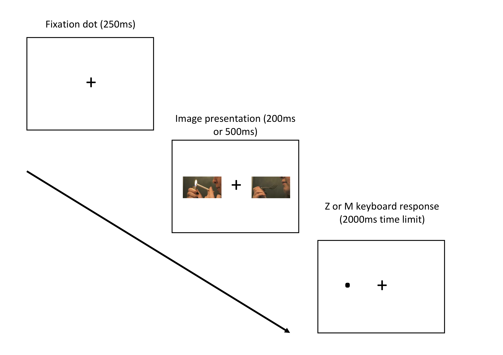

```{r setup, include = FALSE}
library("papaja")
require(tidyverse)
require(janitor)
require(afex)
require(psych)
require(cowplot)
require(splithalf)
library(TOSTER)
library(pwr)

# Download raincloud plot source file
# Taken from Allen et al. at https://github.com/RainCloudPlots/RainCloudPlots
source("raincloud_plot.R")

# This chunk sources custom functions to help with reporting stats and reduce repetition 

source("reporting_functions.R")
```

```{r analysis-preferences}
# Seed for random number generation
set.seed(42)
knitr::opts_chunk$set(cache.extra = knitr::rand_seed)
```

```{r main data, message=F, warning=F, include=F}
# Download the two datafiles 
# demographics contains information such as age, gender etc. in short form 
full_dat <- read_csv("data/OSF_demographics.csv")

# visual probe task data contains task data in long form 
dat <- read_csv(file = "data/OSF_visual_probe_task.csv")

# Use janitor package to clear names to snake case for easier typing 
dat <- clean_names(dat, case = "snake")

# Perform initial screening process 
# focus on trials display and response screen of Gorilla for RT to dot
# Ignore neutral filler trials, incorrect responses, and super fast responses < 200ms 
dat <- dat %>% 
  filter(display == "trials" & screen_name == "response" & trial_type != "neutral" & correct == 1 & reaction_time > 199)

# outlier removal
# 2.5 times the absolute deviation from the median as a threshold (Leys et al. 2013)
# Calculate this for each participant, SOA condition, and trial type 
dat <- dat %>%
  group_by(participant_private_id, soa, trial_type) %>% 
  mutate(median_rt = median(reaction_time),
         MAD_threshold = stats::mad(reaction_time)*2.5) %>% 
  filter(reaction_time > (median_rt - MAD_threshold) & reaction_time < (median_rt + MAD_threshold))

# Calculate how much data (%) present for exclusion criteria later 
trial_n <- dat %>% 
  group_by(participant_private_id) %>% 
  count() %>% 
  mutate(removed = 256 - n,
         removed_perc = (256 - n) / 256 * 100)

# join full data and number of trials for exclusion criteria
full_dat <- right_join(full_dat, trial_n,
                       by = "participant_private_id")

## Apply exclusion criteria

# Note: more specific criteria have to be entered first, or it gets overwritten 
full_dat <- full_dat %>% 
  mutate(included = case_when(smoke_everyday == "Yes" & cigarettes_per_week == "No" ~ 0, # Remove contradictory participants
                              consent_given == 1 & # exclusion criteria from pre-reg
                                age > 17 & age < 61 &
                                device == "computer" & 
                                past_four_weeks == "Yes" & 
                                removed_perc < 50 & # only participants with 50% or more trials
                                technical_issues == "No" ~ 1))

# 3 participants had technical issues with time since last cigarette data, so manually remove 
excluded <- full_dat %>% 
  count(last_cigarette == "Exclude")

# Reduce down to only eligible participants 
full_dat <- full_dat %>% 
  filter(included == 1 & last_cigarette != "Exclude")

# Remove any ineligible participants from task data
dat <- dat %>% 
  filter(participant_private_id %in% full_dat$participant_private_id)

```

# Take-home message

Previous research reported greater attentional bias in daily or non-daily smokers using the dot probe task, but we found no meaningful difference. Our visual probe task also showed poor reliability, meaning the task should not be used in individual differences research or measuring changes in attentional bias across repeated measurements.  

# Purpose 

Daily and non-daily smokers have different habits and motives but both groups find it difficult to quit smoking long-term. As attentional bias may be associated with addictive behaviour, we used the visual probe task to compare daily and non-daily smokers. We predicted that non-daily smokers would show greater attentional bias towards smoking images than daily smokers. If non-daily smokers showed greater attentional bias, it would help to explain why they find it difficult to quit smoking while showing fewer signs of nicotine dependence.  

\newpage

# Introduction

Historically, smokers have been treated as a single homogeneous group [@shiffman_light_2009], but there are fundamental differences in the smoking habits and motives of daily and non-daily smokers [@shiffman_characteristics_2012; @shiffman_smoking_2012]. 13-36% of smokers are defined as non-daily smokers across Europe and the United States [@bogdanovica_smoking_2011; @kotz_very_2012; @tindle_smoking_2011], and non-daily smoking has typically been the most prevalent pattern in ethnic minority groups [@fagan_light_2009; @tong_nondaily_2006]. Whereas daily smokers cite negative reinforcers such as avoiding nicotine withdrawal as the key motivators, non-daily smokers cite positive reinforcers such as smoking around friends and alcohol [@shiffman_smoking_2012; @shiffman_smoking_2014]. Despite these differences, daily and non-daily smokers find it difficult to quit smoking long-term, with 77-92% of daily smokers and 74-83% of non-daily smokers relapsing within 90 days of a quit attempt [@bogdanovica_smoking_2011; @kotz_very_2012; @tindle_smoking_2011]. This means it is important to investigate potential factors associated with the maintenance of smoking behaviour.     

Attentional bias is the tendency to fixate attention on cues associated with smoking [@field_attentional_2008] and it has a small positive relationship with craving [@field_meta-analytic_2009]. Previous research shows that in comparison to non-smokers, smokers exhibit greater attentional bias towards smoking-related cues [@baschnagel_using_2013; @ehrman_comparing_2002; @kang_individual_2012; @mogg_eye_2003]. However, when studies have included different smoking groups, the results have been less consistent. Some studies show that lighter smokers exhibit greater attentional bias than heavier smokers [@bradley_attentional_2003; @hogarth_attentional_2003; @mogg_attentional_2005]. On the other hand, heavier smokers exhibit greater attentional bias than lighter smokers [@chanon_attentional_2010; @vollstadt-klein_attention_2011; @zack_effects_2001]. Despite most studies using the visual probe task, there were inconsistent sample and design features that complicate making conclusions about the mixed findings. This study focused on comparing attentional bias towards smoking cues in daily and non-daily smokers, and manipulating how long the images are displayed for within the task.  

The visual probe task infers attention through differences in response time (RT). Two images are presented and when they disappear, the participant is required to indicate the location of a small probe that replaces one of the images. Faster RTs to particular stimuli reflect selective attention [@field_attentional_2008], but as the location of attention is inferred through differences in RT after the stimuli disappear, the presentation time can be manipulated. Short stimulus onset asynchronies (SOA) of 200ms or less measure involuntary attentional processes [@field_attentional_2008]. Longer SOAs of 500ms or more target voluntary attention as there is enough time to make multiple fixations. Previous research used single SOAs of 500ms [@vollstadt-klein_attention_2011] and 2000ms [@hogarth_attentional_2003; @mogg_attentional_2005]. None of the studies used a very short SOA to measure more involuntary attentional processes. @chanon_attentional_2010 found that in comparison to non-smokers, attentional bias was greater in smokers under a 200ms conditions than a 550ms condition. To investigate the conflict in results between daily and non-daily smokers, this study used two SOAs of 200ms and 500ms. 

A final consideration of our study was to evaluate and report the internal consistency of the visual probe task. There is growing awareness that the reliability of cognitive tasks should be taken seriously [@parsons_psychological_2019; @pennington_raising_2021]. This is not necessarily a problem for experimental research as the tasks are designed to emphasise differences between groups or conditions [@hedge_reliability_2018]. However, reliability is crucial for repeated testing or measuring individual differences. As researchers often use the visual probe task as a measure in cognitive bias modification procedures, it should have the ability to reliably detect any changes across time. Previous attempts at evaluating the reliability of the visual probe task have been disappointing [@schmukle_unreliability_2005; @ataya_internal_2012; @waechter_measuring_2014]. Therefore, we are following recommendations to habitually report the reliability of cognitive tasks [@parsons_psychological_2019], even when it is not the main focus of the study.  

The protocol and hypotheses for this project were pre-registered on the Open Science Framework (OSF; https://osf.io/am9hd/?view_only=3e00300f83e34dc0bddf71408ccc3a12). We hypothesised non-daily smokers would show greater attentional bias than daily smokers. There was no *a priori* hypothesis for the effect of SOA condition. This means we expected non-daily smokers to show greater attentional bias than daily smokers, but it was not clear what the difference in magnitude would be under different SOA conditions. 

# Method

## Design

We used a 2 x 2 mixed design with one between-subjects IV of smoking group with two levels: daily and non-daily smokers. Participants responded to the question "Do you usually smoke cigarettes every day?". Non-daily smokers responded "No" and daily smokers responded "Yes". There was one within-subjects IV of the visual probe task SOA which had two levels: 200ms and 500ms. The dependent variable was the attentional bias index (ms) calculated by subtracting the mean RT to smoking trials from the mean RT to neutral trials. This means positive values indicate greater attentional bias towards smoking cues. 

## Participants and Sample Size Calculation

We collected data online using Prolific where inclusion criteria consisted of participants should have normal or corrected-normal vision, be between the ages of 18 to 60, and smoke at least one cigarette per week or four cigarettes per month.

We simulated a power analysis to inform the sample size. We set the smallest effect size of interest based on a previously unpublished study in our lab (blinded citation) where the mean difference in attentional bias score between smoking groups was 6.13ms (95% CI = [-5.27, 17.53]) for a 200ms SOA and 11.35ms (95% CI = [-4.51, 27.21] for a 500ms SOA. However, we also consulted previous research due to the wide confidence intervals. The smallest known effects for a 200ms SOA was 5ms [@chanon_attentional_2010] and 11ms for a 500ms SOA [@bradley_attentional_2003]. Our smallest effect sizes of interest were 5ms (200ms) and 10ms (500ms), and a conservative standard deviation of 20ms based on @vollstadt-klein_attention_2011. 

These values were used to conduct a simulated power analysis for a 2 x 2 mixed ANOVA using R (code available on the OSF; https://osf.io/am9hd/?view_only=3e00300f83e34dc0bddf71408ccc3a12). We expected non-daily smokers to display greater attentional bias towards smoking images than daily smokers. We set the conditions of the power analysis as non-daily smokers having a 5ms (200ms) and 10ms (500ms) greater mean difference than daily smokers. For each condition, the values were sampled from a normal distribution with a standard deviation of 20ms. The sample size for each smoking group was increased from 10 (N = 20) to 150 (N = 300) in steps of 10, with each step repeating 10,000 times. The final sample size target was 60 per group (N = 120) as we reached 80% power (alpha = .05) between 50 and 60 participants per group.

## Materials 

### Fagerström Test for Cigarette Dependence (FTCD)

```{r FTCD internal consistency}

# Number of iterations for bootstrapping
iters <- 1e4 # 10,000

# Select from the 6 FTCD items 
FTCD_reliability <- full_dat[, 16:21]

# Three participants missing cigarette per day, so remove 
FTCD_reliability <- FTCD_reliability[complete.cases(FTCD_reliability), ]

# Save Cronbach's alpha object with bootstrapping 
FTCD.alpha <- psych::alpha(FTCD_reliability, n.iter = iters)
```

The FTCD [@fagerstrom_determinants_2012; @heatherton_fagerstrom_1991] was used as a self-report measure of nicotine dependence. The Cronbach's alpha estimate (bootstrapped using 10,000 iterations) in this sample was higher than in previous research, $\alpha$ = `r format.alpha(FTCD.alpha)`.

### Visual Probe Task

We used Gorilla [@anwyl-irvine_gorilla_2019] to present the visual probe task online and the task is available on the open materials page to preview or clone (http://gorilla.sc/openmaterials/85021). 

Each trial started with a 250ms central fixation cross before two images were presented horizontally to the left and right. The content and duration of the two images was controlled by two variables: trial type and SOA. Trial type consisted of three conditions (neutral-neutral, smoking-nonsmoking, or nonsmoking-smoking) while SOA consisted of two conditions (200ms or 500ms). At picture offset, a small dot appeared in the location vacated by one of the images. The dot remained on the screen until the participant responded either left (Z key) or right (M key). After they responded, the next trial began with the screen containing only the fixation cross. The trial procedure is shown visually in Figure \@ref(fig:task-plot).

The trial type condition was based on 16 image pairs for neutral-neutral trials and 16 image pairs for smoking-nonsmoking or nonsmoking-smoking trials. We used 16 image pairs from the International Affective Picture System [@lang_international_2008] for the neutral-neutral trials. We developed a series of matching smoking and non-smoking images in our lab (blinded citation) for the smoking-nonsmoking and nonsmoking-smoking trials. The list of IAPS images we used is available on the OSF project and our smoking/non-smoking images are available on the Gorilla open materials page.  

The trial order was randomised with each picture pair presented four times to cover each combination of image (left and right) and dot location (left and right). This combination determined the trial type condition, where a left smoking image, right nonsmoking image, and left dot would produce a smoking-nonsmoking trial. For each picture pair, this process was repeated for each SOA condition. This procedure was repeated twice and presented in two blocks, creating 384 trials overall with 64 trials in each SOA and trial type condition.

(ref:task-plot-caption) Diagram showing the trial procedure of the visual probe task. Each trial started with a fixation cross lasting 250ms. The fixation cross is then flanked by one of the stimulus pairs on the left and right. The stimuli remain on the screen for 200ms or 500ms depending on the SOA condition. The stimuli disappear and one image is replaced with a small dot. Participants had up to 2000ms to respond whether the dot was on the left or right. The next trial started with a new blank fixation cross.  

```{r task-plot, fig.cap="(ref:task-plot-caption)"}



```

## Procedure 

We provided participants with an information sheet and they provided informed consent by ticking a box. This study was approved by the Faculty of Health and Life Sciences Ethical Approval board. Participants completed a short questionnaire on their demographic information, smoking habits, and the FTCD. The next page contained the visual probe task which began with a set of instructions asking the participant to complete the task in a quiet environment free of distractions. Participants completed 12 practice trials which provided feedback on their responses and overall accuracy. After the task, participants reported whether they experienced any technical issues, whether they used an ineligible device, and if they had completed the study before. Similar to @clifford_is_2014, we asked participants if they had any distractions while they completed the study such as listening to music. Finally, participants read a debriefing sheet before they were redirected to Prolific. If the participants successfully reached the end of the study, they were paid £2.

# Results

## Participant Attrition and Demographics  

```{r demographics, include=F, message=F, warning=F}

# Convert data to numeric - read as character originally 
full_dat$age <- as.numeric(full_dat$age)
full_dat$age_started_smoking <- as.numeric(full_dat$age_started_smoking)
full_dat$cpd <- as.numeric(full_dat$cpd)
full_dat$last_cigarette <- as.numeric(full_dat$last_cigarette)

# Add alternate dependence criteria for exploratory analyses
full_dat <- full_dat %>% 
  mutate(FTCD = case_when(FTCDsum < 3 ~ "Non-dependent",
                          FTCDsum > 2 ~ "Dependent"),
         CPD = case_when(cpd  < 10 ~ "Light", 
                         cpd > 9 ~ "Heavy"))

# Subset data into daily and non-daily smokers for table 
nondaily <- full_dat %>% 
  filter(smoke_everyday == "No")

daily <- full_dat %>% 
  filter(smoke_everyday == "Yes")

# Calculate percentage ethnicities in non-daily smokers 
nondaily_ethnicity <- nondaily %>% 
  count(ethnicity) %>%
  mutate(perc = round(n / nrow(nondaily), 2))

# Isolate percentage white participants and format for simple table entry 
nondaily_white <- paste0(nondaily_ethnicity$perc[4]*100, "%")

# Calculate percentage ethnicities in daily smokers 
daily_ethnicity <- daily %>% 
  count(ethnicity) %>%
  mutate(perc = round(n / nrow(daily), 2))

# Isolate percentage white participants and format for simple table entry 
daily_white <- paste0(daily_ethnicity$perc[5]*100, "%")

# Calculate percentage female participants for non-daily smokers 
perc_nondaily <- round(length(subset(nondaily, nondaily$gender == "Female"))/nrow(nondaily)*100, 2)

# format for simple table entry 
perc_nondaily <- paste0(perc_nondaily, "%")

# Calculate percentage female daily smokers 
perc_daily <- round(length(subset(daily, daily$gender == "Female"))/nrow(daily)*100, 2)

# format for simple table entry 
perc_daily <- paste0(perc_daily, "%")

# Build table using tribble to define each cell for non-daily and daily smokers 
desc_table <- tribble(~"", ~"Non-Daily Smokers", ~"Daily Smokers",
        "Age", mean_sd(nondaily$age), mean_sd(daily$age),
        "% female", perc_nondaily, perc_daily,
        "% white", nondaily_white, daily_white,
        "FTCD", mean_sd(nondaily$FTCDsum), mean_sd(daily$FTCDsum),
        "Cigarettes per day", mean_sd(nondaily$cpd), mean_sd(daily$cpd),
        "Age started to smoke", mean_sd(nondaily$age_started_smoking), mean_sd(daily$age_started_smoking),
        "Time since last cigarette (minutes)*", median_IQR(nondaily$last_cigarette), median_IQR(daily$last_cigarette) 
)
```

```{r smoking figure set up, warning=F, message=F, include=F}
# Create plot grid for FTCD and CPD data in daily and non-daily smokers 

# CPD 
CPD.plot <- full_dat %>% 
  ggplot(aes(x = smoke_everyday, y = as.numeric(cpd), fill = smoke_everyday)) + 
  # Define raincloud plot settings (Allen et al. 2019)
  geom_flat_violin(position = position_nudge(x = .2, y = 0),adjust =2) +
  geom_boxplot(aes(x = smoke_everyday, y = as.numeric(cpd)),
               outlier.shape = NA, alpha = 0.6, width = .1, colour = "BLACK") + 
  geom_point(position = position_jitter(width = .15), size = .25) + 
  xlab("Smoking Group") + 
  scale_x_discrete(labels=c("Non-daily", "Daily")) + 
  ylab("Cigarettes Per Day") + 
  scale_fill_grey(start = 0, end = 0.5) + 
  coord_flip() + 
  guides(fill = FALSE) +
  guides(color = FALSE) + 
  theme_cowplot()

# FTCD
FTCD.plot <- full_dat %>% 
  ggplot(aes(x = smoke_everyday, y = FTCDsum, fill = smoke_everyday)) + 
  # Define raincloud plot settings 
  geom_flat_violin(position = position_nudge(x = .2, y = 0),adjust =2) +
  geom_boxplot(aes(x = smoke_everyday, y = FTCDsum),
               outlier.shape = NA, alpha = 0.6, width = .1, colour = "BLACK") + 
  geom_point(position = position_jitter(width = .15), size = .25) + 
  xlab("Smoking Group") + 
  scale_x_discrete(labels=c("Non-daily", "Daily")) + 
  ylab("Total FTCD Score") + 
  scale_fill_grey(start = 0, end = 0.5) + 
  scale_y_continuous(breaks = seq(0, 10, 2),
                     limits = c(0, 10)) + 
  coord_flip() + 
  guides(fill = FALSE) +
  guides(color = FALSE) + 
  theme_cowplot()

# Combine each plot into a grid ordered vertically 
smoking_plot <- plot_grid(CPD.plot, FTCD.plot,
          ncol = 1, nrow = 2, labels = c("A", "B"))

save_plot(plot = smoking_plot,
          filename = "plots/CPD and FTCD plot.png",
          base_height = 7.5, 
          base_width = 7.5)
```

218 people accessed the study and 205 completed the experiment and received payment. The final sample was 166 after applying exclusion criteria: 60 non-daily and 106 daily smokers. Participants were excluded for having fewer than 50% of the possible trials (n = 4), experiencing technical issues (n = 16), reporting to smoke every day but not every week (n = 3), and not smoking in the past four weeks (n = 19). The total number equals 42 as some participants met more than one criterion.   

Table \@ref(tab:demographics-table) displays the demographic information. Daily smokers smoked more cigarettes per day and had a higher FTCD score. Non-daily smokers exemplified infrequent smoking as the median time since their last cigarette was 48 hours, while it was only one hour for daily smokers. Figure \@ref(fig:smoking-plot) shows the distribution of FTCD scores and cigarettes per day.

```{r demographics-table}
# Use papaja helper function to create a pretty table 
apa_table(desc_table,
          caption = "Mean (SD) values for participant characteristics and scale scores.",
          note = "*Due to large skew, these values represent the median and IQR.")
```

(ref:smoking-plot-caption) Two different measures of nicotine dependence: (A) number of cigarettes per day and (B) FTCD score. The data are presented as raincloud plots [@allen_raincloud_2019]. The top element for each group represents the distribution of scores through the density. The bottom element presents the individual data points with a superimposed boxplot.

```{r smoking-plot, fig.cap="(ref:smoking-plot-caption)"}
# Display smoking grid plot. Caption comes from statement previously 
smoking_plot
```

## Data Processing 

```{r missing data}
# Calculate how much missing data to enter into text  
trials_median <- median(full_dat$removed)

trials_range <- range(full_dat$removed)

# What % of trials is remaining? 
trials_removed <- nrow(dat) / (256 * length(unique(dat$participant_private_id))) * 100

trials_removed <- round(100 - trials_removed, 2)
```

The R code is available on the OSF (https://osf.io/am9hd/?view_only=3e00300f83e34dc0bddf71408ccc3a12). Incorrect responses were removed in addition to responses faster than 200ms as they represent preemptive responses. Outliers were defined as any response outside 2.5 times the median absolute deviation for each participant, SOA, and trial condition (Leys et al. 2013). This meant we removed `r trials_removed`% of the total possible trials, with the median number of excluded trials for each participant being `r trials_median` (range `r trials_range[1]` - `r trials_range[2]`). 

For the confirmatory analyses, we focused on smoking/non-smoking stimuli pairs and excluded the neutral-neutral pairs. After removing outliers, we calculated the mean response time to probes that replaced non-smoking images and the mean response time to probes that replaced smoking images. We then calculated the difference between these two values as our attentional bias index (non-smoking - smoking), where positive values mean faster average responses to smoking stimuli. For each participant, this produced two values: one for the attentional bias index using a 200ms SOA and one using a 500ms SOA.  

## Confirmatory Analyses: Attentional Bias Towards Smoking Cues 

```{r mean differences}
# Calculate mean RT for each condition
ab_analysis <- dat %>% 
  group_by(participant_private_id, trial_type, soa) %>% 
  summarise(mean_rt = mean(reaction_time))

# Spread smoking and neutral trials to calculate AB index
ab_analysis <- ab_analysis %>% 
  spread(key = trial_type, value = mean_rt) %>% 
  mutate(ab_index = nonsmoking - smoking)

# Isolate key variables from demographs to join with AB data
smoking_dat <- full_dat %>% 
  select(participant_private_id, smoke_everyday, CPD, FTCD, last_cigarette)

# Add daily / non-daily smoking info 
ab_analysis <- right_join(ab_analysis, smoking_dat,
                       by = "participant_private_id")

# Calculate mean and SD for AB index
ab_descriptives <- ab_analysis %>% 
  group_by(smoke_everyday, soa) %>% 
  summarise(mean_bias = round(mean(ab_index), 2),
            sd_bias = round(sd(ab_index), 2))

```

The mean (*SD*) attentional bias index in the 200ms SOA condition was `r  ab_descriptives$mean_bias[3]`ms (`r ab_descriptives$sd_bias[3]`) for daily smokers and `r  ab_descriptives$mean_bias[1]`ms (`r ab_descriptives$sd_bias[1]`) for non-daily smokers. In the 500ms SOA condition, the mean bias index was `r  ab_descriptives$mean_bias[4]`ms (`r ab_descriptives$sd_bias[4]`) for daily smokers and `r  ab_descriptives$mean_bias[2]`ms (`r ab_descriptives$sd_bias[2]`) for non-daily smokers. This was in the opposite direction to our hypotheses as non-daily smokers were expected to display greater attentional bias towards smoking images than daily smokers. The results are displayed in Figure \@ref(fig:interaction-plot).

```{r ANOVA and interaction plot, warning=F, include=F, message=F}
# Relabel to daily and non-daily smokers to look better 
ab_analysis$smoke_everyday[ab_analysis$smoke_everyday == "Yes"] <- "Daily" 
ab_analysis$smoke_everyday[ab_analysis$smoke_everyday == "No"] <- "Non-daily" 

# Calculate 2x2 ANOVA using afex 
anov <- aov_ez(id = "participant_private_id",
       dv = "ab_index", 
       between = "smoke_everyday",
       within = c("soa"),
       data = ab_analysis)

# Define interaction plot based on anova object 
interaction.plot <- afex_plot(anov, 
          x = "soa", 
          trace = "smoke_everyday",
          error_ci = T, # Show 95% CI 
          legend_title = "Smoking Group",
          point_arg = list(size = 2),
          error_arg = list(size = 1, width = 0.1),
          line_arg = list(size = 1),
          mapping = c("color", "shape", "fill")) + # ensure link and error bars coloured  
  xlab("SOA") + 
  ylab("Attentional Bias Index (ms)") + 
  scale_x_discrete(labels = c("200ms", "500ms")) + 
  geom_hline(yintercept = 0, linetype = 2) + # Display 0 AB index for reference 
  scale_y_continuous(breaks = seq(-100, 100, 25),
                     limits = c(-100, 100)) + 
  scale_color_grey(start = 0, end = 0.5) + 
  theme_cowplot()

save_plot(plot = interaction.plot,
          filename = "plots/AB interaction plot.png",
          base_height = 7.5, 
          base_width = 10)
```

(ref:interaction-plot-caption) Interaction plot showing the mean attentional bias index for daily and non-daily smokers by SOA condition. The error bars represent the 95% CI around the mean. Positive values indicate greater attentional bias towards smoking cues. The grey points show the individual scores per condition.

```{r interaction-plot, fig.cap="(ref:interaction-plot-caption)"}
# Display interaction plot. Caption defined in previous statement. 
interaction.plot

```

We used a 2x2 mixed ANOVA with SOA as a within-subjects IV and smoking group as a between-subjects IV. The mean attentional bias index was the DV. There was not a significant effect of SOA (`r format.afex_anova(anov, 2)`) or smoking group (`r format.afex_anova(anov, 1)`). There was also no significant interaction between the two factors, `r format.afex_anova(anov, 3)`. This did not support our prediction that non-daily smokers would show greater attentional bias than daily smokers.  

## Exploratory Analyses: No Meaningful Difference in Attentional Bias 

```{r equivalence testing results, warning=F, include=F, message=F}
# Isolate mean and SD RT for smoking group and SOA condition 
mean_sd <- ab_analysis %>% 
  group_by(smoke_everyday, soa) %>% 
  summarise(mean_RT = mean(ab_index),
            sd_RT = sd(ab_index))

# Convert to data frame frame from table as formatting was messing up the TOST function 
mean_sd <- as.data.frame(mean_sd)

# Comparing daily and non-daily smokers on 200ms SOA
# boundaries set to d ± .41 based on small telescope approach (Lakens et al. 2018)
# Vollstaedt-Klein et al. 33% power to detect d = .41. 
SOA200 <- TOSTtwo(m1 = mean_sd[1, 3], m2 = mean_sd[3, 3], 
                  sd1 = mean_sd[1, 4], sd2 = mean_sd[3, 4], 
                  n1 = 106, n2 = 60, 
                  low_eqbound_d = -0.41, high_eqbound_d = 0.41)

# Comparing daily and non-daily smokers on 500ms SOA
# Same boundaries as above 
SOA500 <- TOSTtwo(m1 = mean_sd[2, 3], m2 = mean_sd[4, 3], 
                  sd1 = mean_sd[2, 4], sd2 = mean_sd[4, 4], 
                  n1 = 106, n2 = 60, 
                  low_eqbound_d = -0.41, high_eqbound_d = 0.41)

# Populate tibble for key information needed for plotting 
# Isolate mean difference with 90% and 95% CI for each SOA condition 
equivalence_dat <-
  tribble(
    ~ condition,
    ~ mean_diff,
    ~ LL_TOST,
    ~ UL_TOST,
    ~ LL_TTEST,
    ~ UL_TTEST,
    "200ms",
    SOA200$diff,
    SOA200$LL_CI_TOST,
    SOA200$UL_CI_TOST,
    SOA200$LL_CI_TTEST,
    SOA200$UL_CI_TTEST,
    "500ms",
    SOA500$diff,
    SOA500$LL_CI_TOST,
    SOA500$UL_CI_TOST,
    SOA500$LL_CI_TTEST,
    SOA500$UL_CI_TTEST
  )

# Create manual TOST plot to demonstrate the mean difference + 90% / 95% CI 
TOST_plot <- equivalence_dat %>% 
  ggplot(aes(x = condition, y = mean_diff)) + 
  geom_point(size = 5, shape = 3) + # Show mean difference with horizontal line 
  # Create two error bars for 90% and 95% CI - differentiate with thicker 90% line
  geom_errorbar(aes(ymin = LL_TOST, ymax = UL_TOST), width = 0, size = 2) + 
  geom_errorbar(aes(ymin = LL_TTEST, ymax = UL_TTEST), width = 0) + 
  # Demonstrate effect size boundary in raw mean difference units 
  geom_hline(yintercept = -8.42, linetype = 2) +
  geom_hline(yintercept = 8.42, linetype = 2) +
  # Reference point at 0 mean difference 
  geom_hline(yintercept = 0, linetype = 5) +
  scale_y_continuous(breaks = seq(-10, 10, 2),
                     limits = c(-10, 10)) + 
  ylab("Mean Difference in AB Index (ms)") + 
  xlab("SOA Condition") + 
  theme_cowplot() + 
  # flip on it's side to visualise easier 
  coord_flip()

save_plot(plot = TOST_plot, 
          filename = "plots/TOST plot.png",
          base_height = 7.5, 
          base_width = 10)
  
```

To demonstrate there was no meaningful difference between daily and non-daily smokers, we performed equivalence testing on the two comparisons of interest: the difference between daily and non-daily smokers at each SOA condition. We set the effect size boundaries as Cohen's d = ±0.41 based on the small telescopes method [@lakens_equivalence_2018] for the effect size the largest previous study had 33% power to detect (@vollstadt-klein_attention_2011 with two groups of 25 and 26 participants).  

For the 200ms SOA condition, the two one-sided test procedure was significant, demonstrating that the difference in attentional bias towards smoking cues between daily and non-daily smokers was statistically equivalent to zero, `r format.TOST(SOA200)`. Similarly, the 500ms SOA condition was statistically equivalent to zero, `r format.TOST(SOA500)`. The equivalence testing procedure is presented in Figure \@ref(fig:TOST-plot), showing that the 90% confidence interval around the mean difference crosses zero, but does not cross the effect size boundaries of d = ±.41 (expressed here in raw units). 

(ref:TOST-plot-caption) The thin vertical lines show the mean difference in attentional bias index between daily and non-daily smokers in each SOA condition. The thick horizontal black lines represent the 90% confidence interval for the two one-sided test procedure. The thin horizontal black lines represent the 95% confidence interval. The dashed vertical lines represent the equivalence boundaries in raw scores. 

```{r TOST-plot, fig.cap="(ref:TOST-plot-caption)"}
# Display TOST plot - caption defined in previous statement 
TOST_plot

```

## Exploratory Analyses: Visual Probe Task Reliability

```{r cronbachs alpha, message=F, warning=F, results="hide"}
# Calculate Cronbach's alpha for each SOA condition in visual probe task 
# Follow procedure of Christiansen et al. (2015) to calculate AB index for each picture pair 
# Produces 16 AB indexes for each SOA condition. Treat these as "items" to calculate internal consistency 

# Begin by repeating processing for visual probe task data 
rel.dat <- read_csv(file = "data/OSF_visual_probe_task.csv")

rel.dat <- clean_names(rel.dat, case = "snake")

# Perform initial screening process 
rel.dat <- rel.dat %>% 
  filter(display == "trials" & screen_name == "response" & trial_type != "neutral" & correct == 1 & reaction_time > 199)

# outlier removal
# 2.5 times the absolute deviation from the median as a threshold
rel.dat <- rel.dat %>%
  group_by(participant_private_id, soa, trial_type, stimulus_no) %>% 
  mutate(median_rt = median(reaction_time),
         MAD_threshold = stats::mad(reaction_time)*2.5) %>% 
  filter(reaction_time > (median_rt - MAD_threshold) & reaction_time < (median_rt + MAD_threshold))

# Include stimulus number as a factor to get a mean RT per participant, SOA, trial, and stimulus (due to images being repeated)
rel.dat <- rel.dat %>% 
  group_by(participant_private_id, soa, trial_type, stimulus_no) %>%
  filter(participant_private_id %in% full_dat$participant_private_id) %>% # Remove ineligible participants 
  summarise(mean_rt = mean(reaction_time)) %>% 
  spread(key = trial_type, value = mean_rt) %>% 
  mutate(AB_index = nonsmoking - smoking)

# Convert stimulus number to factor 
rel.dat$stimulus_no <- as.factor(rel.dat$stimulus_no)

# Start with 200ms SOA condition 

rel.analysis <- rel.dat %>% 
  filter(soa == 200) %>% 
  select(stimulus_no, AB_index)

# get rid of SOA column to stop it messing up 
rel.analysis <- rel.analysis[c(1, 3, 4)]

# Convert to wide format for one AB index per stimulus number spread across columns 
rel.analysis <- rel.analysis %>% 
  spread(key = stimulus_no, value = AB_index)

# Calculate Cronbach's alpha with 10,000 bootstraps 
alpha.200 <- psych::alpha(rel.analysis[2:17],
             n.iter = 1e4)

# Repeat for 500ms SOA condition 
rel.analysis <- rel.dat %>% 
  filter(soa == 500) %>% 
  select(stimulus_no, AB_index)

# get rid of SOA column to stop it messing up 
rel.analysis <- rel.analysis[c(1, 3, 4)]

# Convert to wide format 
rel.analysis <- rel.analysis %>% 
  spread(key = stimulus_no, value = AB_index)

# Cronbach's alpha with 10,000 bootstraps 
alpha.500 <- psych::alpha(rel.analysis[2:17],
             n.iter = 1e4)
```

We calculated Cronbach's alpha for the attentional bias index across the 16 stimulus pairs which was poor for both the 200ms ($\alpha$ = `r format.alpha(alpha.200)`) and 500ms ($\alpha$ = `r format.alpha(alpha.500)`) SOA conditions. 

```{r split half reliability, message=F, warning=F, results="hide"}

# Parsons et al. (2019) criticised alpha for cognitive tasks and present split half reliability 
# Calculate permutation split half reliability with 5000 iterations 
# No special processing necessary as function takes long form data
difference <- splithalf(data = dat,
                        outcome = "RT",
                        score = "difference", # Calculate mean difference in RT between conditions
                        conditionlist = c("200", "500"),
                        halftype = "random",
                        permutations = 5000,
                        var.RT = "reaction_time",
                        var.condition = "soa",
                        var.participant = "participant_private_id",
                        var.trialnum = "trial_number",
                        var.compare = "trial_type",
                        compare1 = "nonsmoking",
                        compare2 = "smoking",
                        average = "mean")

```

We reported internal consistency estimates for comparison with previous studies, but they assume the items or trials are presented in the same order [@parsons_psychological_2019]. As cognitive tasks randomise trials, internal consistency may not be the best approach. An alternative is a permutation approach to calculating split-half reliability [@R-splithalf]. This randomly splits the data set into two halves many times and calculates the average correlation between each half. Using 5000 iterations, poor reliability was also reflected in the split-half estimate (corrected using the Spearman-Brown formula) for the 200ms (`r format.splithalf(difference, "200")[1]`) and 500ms (`r format.splithalf(difference, "500")[2]`) SOA conditions. 

# Discussion

We hypothesised that non-daily smokers would display greater attentional bias towards smoking cues than daily smokers. Some studies found that non-daily smokers exhibited greater attentional bias [@bradley_attentional_2003; @hogarth_attentional_2003; @mogg_attentional_2005], whereas others found that daily smokers displayed greater attentional bias [@chanon_attentional_2010; @vollstadt-klein_attention_2011; @zack_effects_2001]. Using traditional methods, there were no significant differences, and using equivalence testing showed there was no meaningful difference in attentional bias in daily and non-daily smokers.

```{r sensitivity power}

vollstaedt_sensitivity <- round(
  pwr.t2n.test(n1 = 25, # 166 participants in total
             n2 = 26, 
             power = 0.8,
             sig.level = .05)$d, # Isolate the effect size for sensitivity
  2)

d_power <- round(
  pwr.t2n.test(n1 = 60, # 166 participants in total
                n2 = 106, 
             d = 0.8,
             sig.level = .05)$power, # Isolate the effect size for sensitivity
  3)*100

study_sensitivity <- round(
  pwr.t2n.test(n1 = 60, # 166 participants in total
             n2 = 106, 
             power = 0.8,
             sig.level = .05)$d, # Isolate the effect size for sensitivity
  2)

```

We may have found null results as previous research could have problems with inflated effect sizes due to low statistical power. The previous largest sample was 51 smokers in @vollstadt-klein_attention_2011. Splitting these into 25 and 26 participants, a sensitivity power analysis indicates that this sample size would be sensitive to detect effect sizes of Cohen’s d = `r vollstaedt_sensitivity` (alpha = .05, beta = .20). Incidentally, @schafer_meaningfulness_2019 showed that the median Cohen's d in a random selection of 684 non-pre-registered articles was 0.80. In the long-run, our study would have `r d_power`% power to detect an effect size of 0.80. Therefore, it is unlikely the effect size between daily and non-daily smokers is this large, or we would have had enough power to detect it. Our study had the largest known sample size to investigate attentional bias with 60 non-daily smokers and 106 daily smokers. A sensitivity power analysis shows that this was sensitive to detect effect sizes of Cohen’s d = `r study_sensitivity`. Our study was sensitive to detect an effect size of almost half the size of @vollstadt-klein_attention_2011. Our results were statistically equivalent to zero, meaning there may not be a meaningful difference in attentional bias between smoking groups, at least in its current implementation where the effect is assumed to represent stable trait-like group differences.

Contemporary theories suggest attentional bias may not be a trait-like phenomenon that can produce stable differences between groups. @field_role_2016 suggested that attentional bias varies depending on how substance cues are being evaluated. The theory suggests that rather than being a stable trait between groups, it fluctuates with the incentive value of a cue which makes within-group differences more important. @begh_association_2016 found that laboratory measures like the visual probe task did not predict smoking behaviour in the real-world. However, ecological momentary assessment of craving and awareness of smoking cues did predict smoking behaviour. Therefore, the null results in our study may be a product of the fluctuating nature of attentional bias [@field_role_2016]. In smaller samples, attentional bias could fluctuate one way or the other, but in larger samples like our study, the differences could cancel out and converge to a mean difference around zero. Therefore, future research may benefit from investigating which factors affect the momentary evaluation of substance cues and the subsequent expression of attentional bias.

Using the visual probe task to measure factors that affect the momentary evaluation of substance cues may be problematic though. There are vocal critics of the task due to its questionable level of internal consistency [@ataya_internal_2012; @schmukle_unreliability_2005; @waechter_measuring_2014]. Our study also had suboptimal levels of internal consistency and split-half reliability. Researchers rarely report the reliability of cognitive tasks unless it is the main focus of the article [@parsons_psychological_2019], which means it is difficult to assess how reliable the tasks were in previous smoking research. In experimental studies, low reliability is not critical as cognitive tasks emphasise group differences [@hedge_reliability_2018], but if researchers plan to use the visual probe task across multiple measurements - such as in cognitive bias modification or the evaluation of substance cues - then its poor psychometric properties *are* problematic. Future research should use eye-tracking as a direct measure of attentional bias as it produces larger effect sizes [@field_meta-analytic_2009], has higher internal consistency [@price_empirical_2015], and higher criterion validity [@soleymani_free-viewing_2020].

## Limitations 

Our sample may have been more diverse than typical undergraduates in age and education, but it still contained predominantly white participants. Non-daily smoking is more prevalent in ethnic minority groups [@fagan_light_2009; @levy_natural_2009] and the health implications of smoking disproportionately affect non-white smokers [@st.helen_black_2019]. Therefore, future research would benefit from recruiting a larger proportion of non-white smokers for the results to generalise beyond mostly white smokers.

The online nature of the study meant participants’ smoking levels could not be verified objectively using measures like Carbon Monoxide [@wray_comparative_2016], but @ramo_reliability_2011 demonstrated that smoking-related information collected online has good reliability and validity. Relatedly, as participants completed the study online, there was no control over their smoking behaviour before and during the study. This lead to idiosyncrasies as some smokers reported to smoke while they were completing the study. Although this may represent a more naturalistic environment for the smokers, our study had less control over smokers' deprivation levels.

## Conclusion 

We expected non-daily smokers to show greater attentional bias towards smoking images than daily smokers. Greater attentional bias in non-daily smokers would have helped to explain why they find it difficult to quit smoking while showing fewer signs of nicotine dependence. However, using equivalence testing, we found that there was no meaningful difference in attentional bias between daily and non-daily smokers. The results can be interpreted in line with contemporary theories of attentional bias where there may not be stable trait-level differences between smoking groups in attentional bias. Future research should focus on investigating how attentional bias fluctuates over time using more reliable measures than the visual probe task. 
\newpage

# Disclosures

## Data, code, and materials

The data and code to reproduce these analyses are available on the OSF (https://osf.io/am9hd/?view_only=3e00300f83e34dc0bddf71408ccc3a12). The OSF project contains all necessary files to reproduce the analyses and figures. The visual probe task was created in Gorilla and the task can be found using the open materials page (http://gorilla.sc/openmaterials/85021)

## R Package Acknowledgements
```{r r packages}
# Use papaja function to report R and package citations 
# Manually removed some functions within tidyverse that were not used in the analyses 
my_citations <- cite_r(file = "r-references.bib", 
                       pkgs = c("forcats", "lme4", "Matrix", "purrr", "tidyverse"), 
                       withhold = TRUE)
```

The results were created using `r my_citations`. 

\newpage

# References
```{r create_r-references}
# Create bib files for loaded packages

# Will be cited in my_citations above and formatted into bibliography below 
r_refs(file = "r-references.bib")
```

\begingroup
\setlength{\parindent}{-0.5in}
\setlength{\leftskip}{0.5in}

<div id="refs" custom-style="Bibliography"></div>
\endgroup
